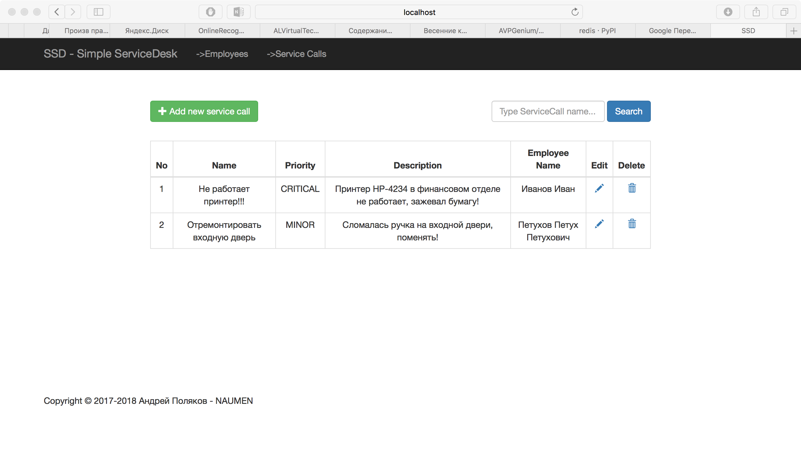
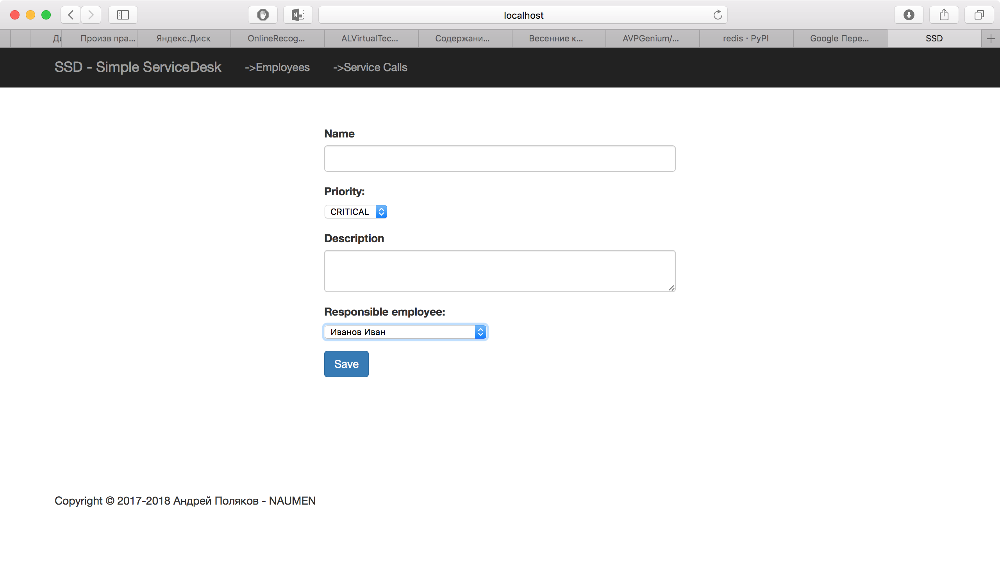
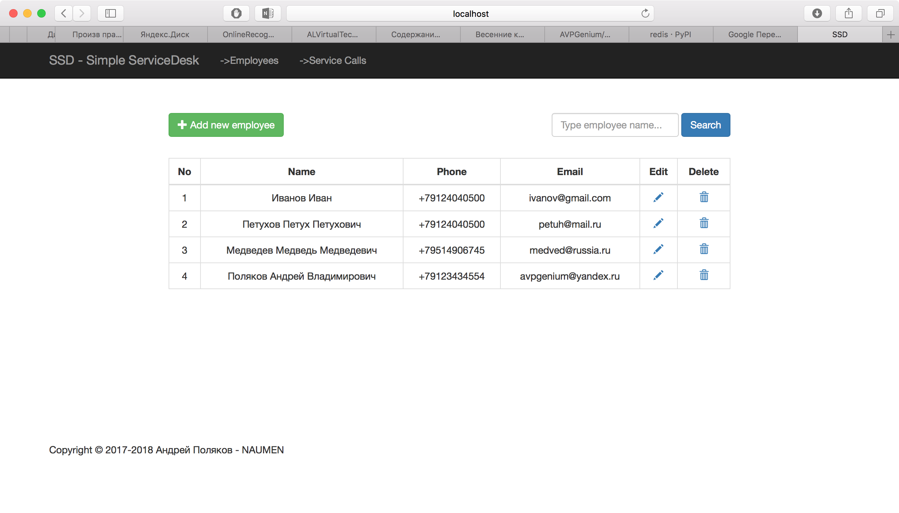

# Simple-Service-Desk
Приложение для управления задачами

 ## Работа с задачами:
 
 На главной странице сервиса отображается список задач (доступны CRUD операции (добавление, редактирование, удаление задачи  и просмотр списка всех задач) и поиск по названию задачи).
 
 
 
 Для задачи доступны следующие атрибуты:
  1. Название
  2. Приоритет (низкий, средний, высокий)
  3. Описание
  4. Ответственный сотрудник
  
  Форма добавление (редактирования) задачи:
 
 
 
 ## Список сотрудников организации
 
 (доступны CRUD операции (добавление, редактирование, удаление сотрудника и просмотр списка всех сотрудников) и поиск по имени или  email-адресу сотрудника.
 
 
 
 На форме добавления сотрудника действует следующая валидация:
 1. Имя сотрудника должно состоять из букв латинского/русского алфавита, быть длиной от 5 до 30 символов.
 2. Должен быть введен корректный телефон сотрудника, соответствующий маске 8 (9xx) xxx - xx - xx или +7 (9xx) xxx - xx - xx
 3. Должен быть введен корректный email-адрес
 
 

 
